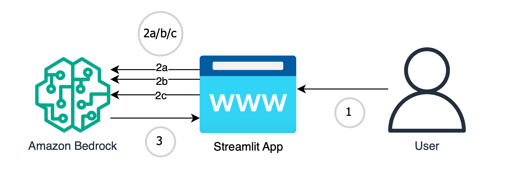

# Amazon-Bedrock-Asynchronous-Invocation-POC
This is sample code demonstrating the use of Amazon Bedrock and Generative AI to perform asynchronous invocations of large language models. The application is constructed with a simple streamlit frontend where users can input zero shot requests directly against the LLM of their choice, leveraging asynchronous invocations, to invoke 3 models simultaneously to reduce overall latency.


# **Goal of this Repo:**
The goal of this repo is to provide users the ability to use Amazon Bedrock in an asynchronous manner allowing users to invoke multiple models at once, reducing overall latency.
This repo comes with a basic frontend to help users stand up a proof of concept in just a few minutes.

The architecture and flow of the sample application will be:



When a user interacts with the GenAI app, the flow is as follows:

1. The user inserts a text question into to the streamlit app. (app.py).
2. The streamlit app, takes the text and passes it into 3 different LLMs (Claude 3 - Haiku, Claude 3 - Sonnet, Claude 2.1) simultaneously through an asynchronous invocation of Amazon Bedrock. (asynchronous_invocations.py).
3. A natural language response is returned for each of the models to the end user, along with a timer demonstrating the decrease in latency caused by using asynchronous invocations.(app.py).

# How to use this Repo:

## Prerequisites:

1. Amazon Bedrock Access and CLI Credentials.
2. Ensure Python 3.10 installed on your machine, it is the most stable version of Python for the packages we will be using, it can be downloaded [here](https://www.python.org/downloads/release/python-3100/).

## Step 1:
The first step of utilizing this repo is performing a git clone of the repository.

```
https://github.com/aws-samples/genai-quickstart-pocs.git
```

After cloning the repo onto your local machine, open it up in your favorite code editor. The file structure of this repo is broken into 3 key files,
the app.py file, the asynchronous_invocations.py file and the requirements.txt. The app.py file houses the frontend application (a streamlit app). 
The asynchronous_invocations.py file houses the logic of the asynchronous invocation of Amazon Bedrock.
The requirements.txt file contains all necessary dependencies for this sample application to work.

## Step 2:
Set up a python virtual environment in the root directory of the repository and ensure that you are using Python 3.10. This can be done by running the following commands:
```
pip install virtualenv
python3.10 -m venv venv
```
The virtual environment will be extremely useful when you begin installing the requirements. If you need more clarification on the creation of the virtual environment please refer to this [blog](https://www.freecodecamp.org/news/how-to-setup-virtual-environments-in-python/).
After the virtual environment is created, ensure that it is activated, following the activation steps of the virtual environment tool you are using. Likely:
```
cd venv
cd bin
source activate
cd ../../ 
```
After your virtual environment has been created and activated, you can install all the requirements found in the requirements.txt file by running this command in the root of this repos directory in your terminal:
```
pip install -r requirements.txt
```

## Step 3:
Now that the requirements have been successfully installed in your virtual environment we can begin configuring environment variables.
You will first need to create a .env file in the root of this directory within this repo. Within the .env file you just created you will need to configure the .env to contain:

```
profile_name=<AWS_CLI_PROFILE_NAME>
region_name=us-east-1
```
Please ensure that your AWS CLI Profile has access to Amazon Bedrock!

Depending on the region and model that you are planning to use Amazon Bedrock in, you may need to reconfigure line 86 in the asynchronous_invocation.py file. Currently, this application is only suited to use Anthropic models:

```python
async def orchestrator(question, modelID1="anthropic.claude-3-sonnet-20240229-v1:0", modelID2="anthropic.claude-3-haiku-20240307-v1:0", modelID3='anthropic.claude-v2:1'):
    result = await asyncio.gather(main(question, modelID1), main(question, modelID2), main(question, modelID3))
    print(result)
    return result
```

## Step 4:
As soon as you have successfully cloned the repo, created a virtual environment, activated it, installed the requirements.txt, and created a .env file, your application should be ready to go. 
To start up the application with its basic frontend you simply need to run the following command in your terminal while in the root of the repositories' directory:

```
streamlit run app.py
```
As soon as the application is up and running in your browser of choice you can begin leveraging asynchronous invocations of Amazon Bedrock to invoke multiple calls to LLMs simultaneously allowing you to reduce overall latency.
