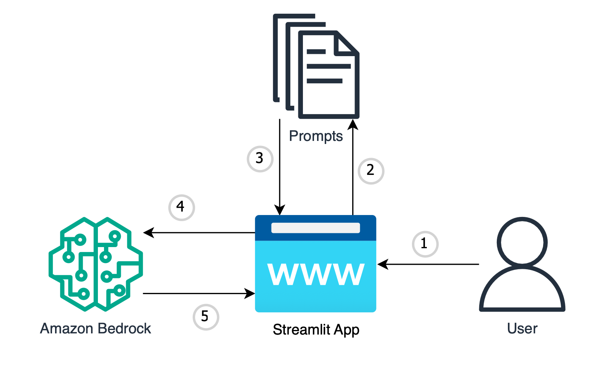

# Amazon-Bedrock-Chat-POC

This is sample code demonstrating the use of Amazon Bedrock and Generative AI to implement a ChatGPT alternative. The application is constructed with a simple streamlit frontend where users can input zero shot requests to satisfy a broad range of use cases.

# **Goal of this Repo:**

The goal of this repo is to provide users the ability to use Amazon Bedrock in a similar fashion to ChatGPT.
This repo comes with a basic frontend to help users stand up a proof of concept in just a few minutes.

The architecture and flow of the sample application will be:



When a user interacts with the GenAI app, the flow is as follows:

1. The user makes a "zero-shot" request to the streamlit frontend. (app.py).
2. The application performs a semantic search of the users query against the 1200+ prompts. (prompt_finder_and_invoke_llm.py).
3. The application returns the 3 most semantically similar prompts, and creates a final prompt that contains the 3 returned prompts along with users query (few-shot prompting) (prompt_finder_and_invoke_llm.py).
4. The final prompt is passed into Amazon Bedrock to generate an answer to the users question (prompt_finder_and_invoke_llm.py).
5. The final answer is generated by Amazon Bedrock and displayed on the frontend application (app.py).

# How to use this Repo:

## Prerequisites:

1. Amazon Bedrock Access and CLI Credentials.
2. Ensure Python 3.9 installed on your machine, it is the most stable version of Python for the packages we will be using, it can be downloaded [here](https://www.python.org/downloads/release/python-3911/).

## Step 1:

The first step of utilizing this repo is performing a git clone of the repository.

```
git clone https://github.com/aws-samples/genai-quickstart-pocs.git
```

After cloning the repo onto your local machine, open it up in your favorite code editor. The file structure of this repo is broken into 4 key files,
the app.py file, the prompt_finder_and_invoke_llm.py file, the chat_history_prompt_generator.py file, and the requirements.txt. The app.py file houses the frontend application (a streamlit app).
The prompt_finder_and_invoke_llm.py file houses the logic of the application, including the semantic search against the prompt repository and prompt formatting logic and the Amazon Bedrock API invocations.
The chat_history_prompt_generator.py houses the logic required to preserve session state and to dynamically inject the conversation history into prompts to allow for follow-up questions and conversation summary.
The requirements.txt file contains all necessary dependencies for this sample application to work.

## Step 2:

Set up a python virtual environment in the root directory of the repository and ensure that you are using Python 3.9. This can be done by running the following commands:

```
pip install virtualenv
python3.9 -m venv venv
```

The virtual environment will be extremely useful when you begin installing the requirements. If you need more clarification on the creation of the virtual environment please refer to this [blog](https://www.freecodecamp.org/news/how-to-setup-virtual-environments-in-python/).
After the virtual environment is created, ensure that it is activated, following the activation steps of the virtual environment tool you are using. Likely:

```
cd venv
cd bin
source activate
cd ../../
```

After your virtual environment has been created and activated, you can install all the requirements found in the requirements.txt file by running this command in the root of this repos directory in your terminal:

```
pip install -r requirements.txt
```

## Step 3:

Now that the requirements have been successfully installed in your virtual environment we can begin configuring environment variables.
You will first need to create a .env file in the root of this repo. Within the .env file you just created you will need to configure the .env to contain:

```
profile_name=<AWS_CLI_PROFILE_NAME>
```

Please ensure that your AWS CLI Profile has access to Amazon Bedrock, and your Amazon Kendra Index has been created within your AWS account!

Depending on the region and model that you are planning to use Amazon Bedrock in, you may need to reconfigure line 23 & 122 in the prompt_finder_and_invoke_llm.py file:

```
bedrock = boto3.client('bedrock-runtime', 'us-east-1', endpoint_url='https://bedrock-runtime.us-east-1.amazonaws.com')

modelId = 'anthropic.claude-v2'
```

## Step 4:

As soon as you have successfully cloned the repo, created a virtual environment, activated it, installed the requirements.txt, and created a .env file, your application should be ready to go.
To start up the application with its basic frontend you simply need to run the following command in your terminal while in the root of the repositories' directory:

```
streamlit run app.py
```

As soon as the application is up and running in your browser of choice you can begin asking zero-shot questions and leveraging this app as you would ChatGPT.
