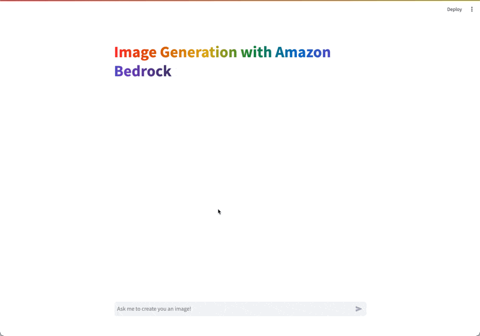

# Amazon-Bedrock-Image-Generation-POC

This is sample code demonstrating the use of Amazon Bedrock and Multi-Modal Generative AI models from Anthropic to implement an image analysis use case. The application is constructed with a simple streamlit frontend where users can upload a jpeg, and get a description of the image.


# **Goal of this Repo:**

The goal of this repo is to provide users with the ability to analyze images with Generative AI. This can be integrated into applications like image classification, reverse image lookup, object detection and more. This repo comes iwth a basic streamlit front-end to help users stand up a proof of concept and experiment with image analysis use-cases quickly.


The architecture and flow of the sample application will be:


When a user interacts with the GenAI app, the flow is as follows:

1. The user uploads an image for bedrock model to analyze. (app.py).
2. The streamlit app, takes the image input, and invokes Amazon Bedrock to generate a description (image_analysis.py).
3. The image created by Amazon Bedrock is returned and displayed on the streamlit app (app.py).

# How to use this Repo:

## Prerequisites:

1. Amazon Bedrock Access and CLI Credentials.
2. Ensure Python 3.9 installed on your machine, it is the most stable version of Python for the packages we will be using, it can be downloaded [here](https://www.python.org/downloads/release/python-3911/).

## Step 1:

The first step of utilizing this repo is performing a git clone of the repository.

```
git clone https://github.com/aws-samples/genai-quickstart-pocs.git
```

After cloning the repo onto your local machine, open it up in your favorite code editor. The file structure of this repo is broken into 3 key files,
the app.py file, the image_generation.py file, and the requirements.txt. The app.py file houses the frontend application (a streamlit app).
The image_generation.py file houses the logic of the application, including the Amazon Bedrock API invocations to generate an image.
The requirements.txt file contains all necessary dependencies for this sample application to work.

## Step 2:

Set up a python virtual environment in the root directory of the repository and ensure that you are using Python 3.9. This can be done by running the following commands:

```
pip install virtualenv
python3.9 -m venv venv
```

The virtual environment will be extremely useful when you begin installing the requirements. If you need more clarification on the creation of the virtual environment please refer to this [blog](https://www.freecodecamp.org/news/how-to-setup-virtual-environments-in-python/).
After the virtual environment is created, ensure that it is activated, following the activation steps of the virtual environment tool you are using. Likely:

```
cd venv
cd bin
source activate
cd ../../
```

After your virtual environment has been created and activated, you can install all the requirements found in the requirements.txt file by running this command in the root of this repos directory in your terminal:

```
pip install -r requirements.txt
```

## Step 3:

Now that the requirements have been successfully installed in your virtual environment we can begin configuring environment variables.
You will first need to create a .env file in the root of this repo. Within the .env file you just created you will need to configure the .env to contain:

```
profile_name=<AWS_CLI_PROFILE_NAME>
```

Please ensure that your AWS CLI Profile has access to Amazon Bedrock!

Depending on the region and model that you are planning to use with Amazon Bedrock (please note that only a few models can generate images based on text input), you may need to reconfigure line 13 & 31 in the image_generation.py file:

```
bedrock = boto3.client('bedrock-runtime', 'us-east-1', endpoint_url='https://bedrock.us-east-1.amazonaws.com')

modelId = 'stability.stable-diffusion-xl-v1'
```

## Step 4:

As soon as you have successfully cloned the repo, created a virtual environment, activated it, installed the requirements.txt, and created a .env file, your application should be ready to go.
To start up the application with its basic frontend you simply need to run the following command in your terminal while in the root of the repositories' directory:

```
streamlit run app.py
```

As soon as the application is up and running in your browser of choice you can begin creating images!
