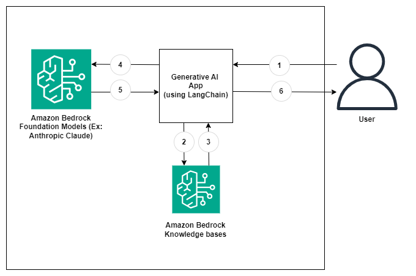
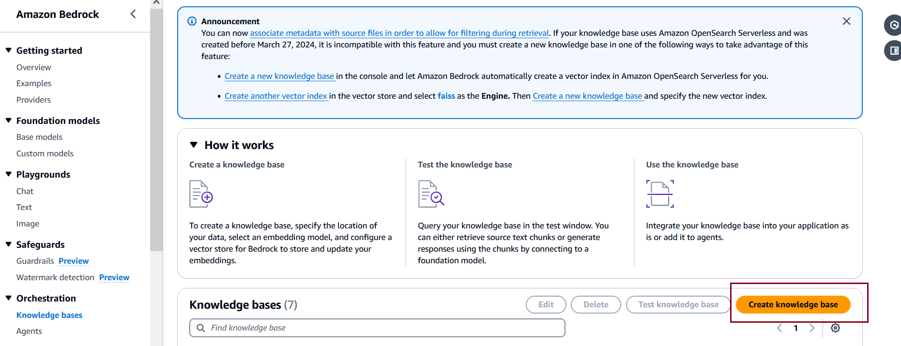
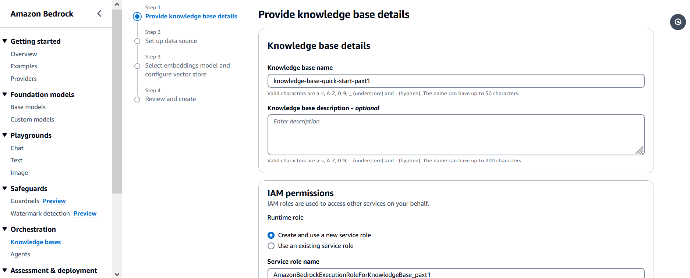
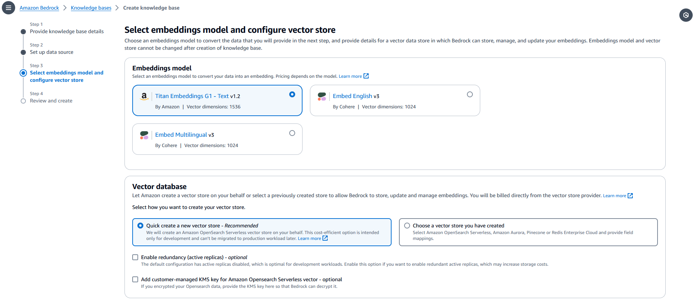

# Amazon-Bedrock-Langchain-RAG-POC

This is sample code demonstrating the use of Amazon Bedrock and Generative AI using Langchain as orchestrator with the ability ask questions against the stored documents. This sample uses Knowledge bases as to retrieve the stored documents, however you can extend or update this sample to retrieve your stored documents from any Vector DB.


# **Goal of this Repo:**

The goal of this repo is to provide users the ability to use Amazon Bedrock and generative AI to take natural language questions orchestrated using Langchain, and answer questions against your stored documents.
This repo comes with a basic frontend to help users stand up a proof of concept in just a few minutes.

The architecture and flow of the sample application will be:



When a user interacts with the GenAI app, the flow is as follows:

1. The user makes a request to the GenAI app (app.py).
2. The app issues a get contexts query to the Amazon Bedrock Knowledge bases using Langchain based on the user request. (query_with_langchain.py)
3. The knowledge bases returns search results related to the relevant documents from the ingested data. (query_with_langchain.py)
4. The app sends the user request and along with the data retrieved from the Amazon Bedrock Knowlegebases as context in the LLM prompt to a LLM available within Bedrock using Langchain. (query_with_langchain.py)
5. The LLM returns a succinct response to the user request based on the retrieved data. (query_with_langchain.py)
6. The response from the LLM is sent back to the user. (app.py)

# How to use this Repo:

## Prerequisites:

1. Amazon Bedrock Access and CLI Credentials.
2. Appropriate permissions to configure Amazon Bedrock Knowledge bases.
3. Ensure Python 3.9 installed on your machine, it is the most stable version of Python for the packages we will be using, it can be downloaded [here](https://www.python.org/downloads/release/python-3911/).

## Step 1:

The first step of utilizing this repo is performing a git clone of the repository.

```
git clone https://github.com/aws-samples/genai-quickstart-pocs.git
```

After cloning the repo onto your local machine, open it up in your favorite code editor.The file structure of this repo is broken into 3 key files,
the app.py file,  query_with_langchain.py file and the requirements.txt.
The app.py file houses the frontend application (a streamlit app).
The query_with_langchain.py file houses the logic for taking a user question and letting the LLM generate a response, this includes both the Knowledge bases get contexts calls and Amazon Bedrock LLM API invocation using langchain.
The requirements.txt file contains all necessary dependencies for this sample application to work.

## Step 2:

Set up a python virtual environment in the root directory of the repository and ensure that you are using Python 3.9. This can be done by running the following commands:

```
pip install virtualenv
python3.9 -m venv venv
```

The virtual environment will be extremely useful when you begin installing the requirements. If you need more clarification on the creation of the virtual environment please refer to this [blog](https://www.freecodecamp.org/news/how-to-setup-virtual-environments-in-python/).
After the virtual environment is created, ensure that it is activated, following the activation steps of the virtual environment tool you are using. Likely:

```
cd venv
cd bin
source activate
cd ../../
```

After your virtual environment has been created and activated, you can install all the requirements found in the requirements.txt file by running this command in the root of this repos directory in your terminal:

```
pip install -r requirements.txt
```

## Step 3:

Now that we have successfully cloned the repo, created and activated the virtual environment and installed the necessary dependencies, it is time for us to create Amazon Bedrock Knowledge base.

To create our Amazon Bedrock Knowledge base we will:

1. Go to the Amazon Bedrock Service homepage within the AWS console and on the left-hand side we will select "Knowledge bases" under the "Orchestration" drop down 

2. We will then click on "Create knowledge base" 

3. In the Knowledge base details section, you can optionally change the default name and provide a description for your knowledge base.In the IAM permissions section, choose an AWS Identity and Access Management (IAM) role that provides Amazon Bedrock permission to access other AWS services. You can let Amazon Bedrock create the service role or choose a custom role that you have created. Optionally, add tags to your knowledge base. Select Next. 

4. On the Set up data source page, provide the information for the data source to use for the knowledge base: Optionally, change the default Data source name. Provide the S3 URI of the object containing the files for the data source that you prepared. Select Next. 

5. In the Embeddings model section, choose a supported embeddings model to convert your data into vector embeddings for the knowledge base. In the Vector database section, choose Quick create a new vector store and select Next 

6. On the Review and create page, check the configuration and details of your knowledge base. Choose Edit in any section that you need to modify. When you are satisfied, select Create knowledge base.


## Step 4:

Now that the requirements have been successfully installed in your virtual environment, your Bedrock Knowledge base is created, we can now begin configuring environment variables.
You will first need to create a .env file in the root of this repo. Within the .env file you just created you will need to configure the .env to contain:

```
profile_name=<AWS_CLI_PROFILE_NAME>
knowledge_base_id=<Knowledge Base Id of the the Knowledge Base we created in the previous step>
llm_model = < LLM model that you want to use for the POC, either "amazon-titan" or "anthropic-claude >
```

Please ensure that your AWS CLI Profile has access to Amazon Bedrock!

Depending on the region and model that you are planning to use Amazon Bedrock in, you may need to reconfigure line 19 and 20 in the query_with_langchain.py file to change the region:

```
bedrock = boto3.client('bedrock-runtime', 'us-east-1')
bedrock_agent_runtime = boto3.client('bedrock-agent-runtime','us-east-1')
```
Since this repository is configured to leverage Amazon Titan or Anthropic Claude 3 models, the prompt payload is structured in formats required for the invocation of these two models. 
If you wanted to leverage other Amazon Bedrock models, you can update query_with_langchain.py code. 
For example if you to call Amazon Titan Lite instead of Amazon Titan Express, you can update call_titan funciton in query_with_langchain to look like this:

```python

        
def call_titan(query, retriever):
    """
    This function is used to call Amazon Titan Express LLM model using Langchain.
    :param query: Contains the Question asked by the user
    :param retriever: Contains the  contexts retrieved from the Amazon Bedrock Knowledge base
    :return: Response recieved from LLM for the input user query
    """

    # Setting Model kwargs
    model_kwargs = {
        "maxTokenCount": 4096,
        "stopSequences": [],
        "temperature": 0,
        "topP": 1,
    }

    # Setting LLM method from the Language Bedrock library
    llm = Bedrock(
        client=bedrock, model_id="amazon.titan-text-lite-v1", model_kwargs={} #updating the model_id param to to Amazon Titan Lite
    )

    # Invoke Amazon Titan using the Langchain llm method
    qa = RetrievalQA.from_chain_type(
        llm=llm, retriever=retriever, return_source_documents=True
    )

    answer = qa(query)

    # Returning the response
    return answer        
```

You can then change the model_id param value to the other available models from Amazon Titan.

This repository is configured to leverage Knowledge bases. 
If you want to use other Vector DBs that are not supported in Amazon Bedrock Knowledge Bases, or want to directly retreive contexts from Vector DB using langchain, you can refere to [this Langchain documentation](https://www.freecodecamp.org/news/how-to-setup-virtual-environments-in-python/).


## Step 7:

As soon as you have successfully configured the environment variables and the required code changes, your application should be ready to go.
To start up the application with its basic frontend you simply need to run the following command in your terminal while in the root of the repositories' directory:

```
streamlit run app.py
```

As soon as the application is up and running in your browser of choice you can begin asking natural language questions against the data sources that you configured with Knowledge bases.
